# BookShelf

書籍の登録・検索・レビュー・お気に入りなどを管理するための書籍管理アプリケーションです。

## 主な機能

- ユーザー認証
- 書籍一覧表示
- 書籍詳細表示
- 書籍登録
- 書籍編集
- 書籍削除
- キーワード検索
- ジャンル絞り込み
- レビュー投稿・削除
- 平均評価・レビュー件数表示
- REST API
    - 書籍一覧取得
    - 書籍詳細取得
    - 書籍登録
    - 書籍更新
    - 書籍削除

## ER図

```mermaid
erDiagram
    USERS ||--o{ BOOKS : creates
    USERS ||--o{ REVIEWS : writes
    USERS ||--o{ FAVORITES : has
    USERS ||--o{ REVIEW_LIKES : likes

    BOOKS ||--o{ REVIEWS : has
    BOOKS ||--o{ FAVORITES : favorited
    BOOKS ||--o{ BOOK_GENRE : has

    GENRES ||--o{ BOOK_GENRE : categorizes
    REVIEWS ||--o{ REVIEW_LIKES : receives

    USERS {
        bigint id PK
        varchar name
        varchar email UK
        varchar password
    }

    BOOKS {
        bigint id PK
        bigint user_id FK
        varchar title
        varchar author
        varchar isbn UK
        date published_date
        text description
        varchar image_url
    }

    GENRES {
        bigint id PK
        varchar name UK
    }

    BOOK_GENRE {
        bigint id PK
        bigint book_id FK
        bigint genre_id FK
    }

    REVIEWS {
        bigint id PK
        bigint user_id FK
        bigint book_id FK
        tinyint rating
        text comment
    }

    FAVORITES {
        bigint id PK
        bigint user_id FK
        bigint book_id FK
    }

    REVIEW_LIKES {
        bigint id PK
        bigint user_id FK
        bigint review_id FK
    }
```




    ## 環境構築

### Dockerビルド

1. リポジトリをクローン

```bash
git clone https://github.com/mayuniwata/bookshelf-app.git
````

2. プロジェクトディレクトリへ移動

```bash
cd bookshelf-app
```

3. Composerパッケージをインストール

```bash
composer install
```

4. `.env` ファイルを作成

```bash
cp .env.example .env
```

5. Laravel Sailを起動

```bash
./vendor/bin/sail up -d
```

6. アプリケーションキーを作成

```bash
./vendor/bin/sail artisan key:generate
```

7. マイグレーション・シーディングを実行

```bash
./vendor/bin/sail artisan migrate --seed
```

### 使用技術

- PHP 8.5
- Laravel 10
- MySQL
- Laravel Sail
- Docker

### URL

- アプリケーション：http://localhost
- 書籍一覧：http://localhost/books
- API：http://localhost/api/v1/books
